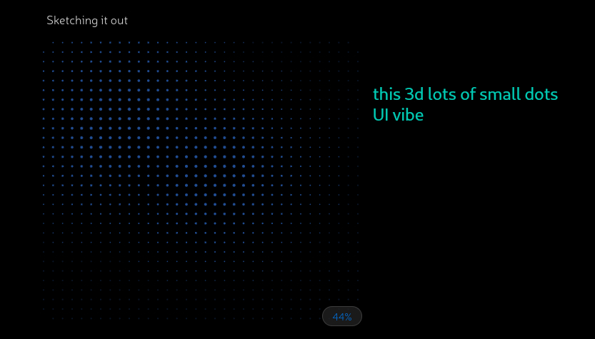
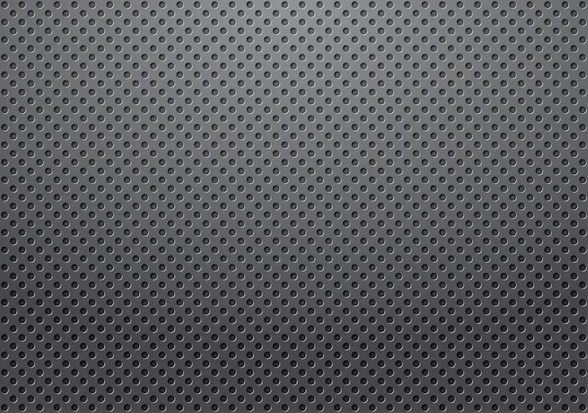
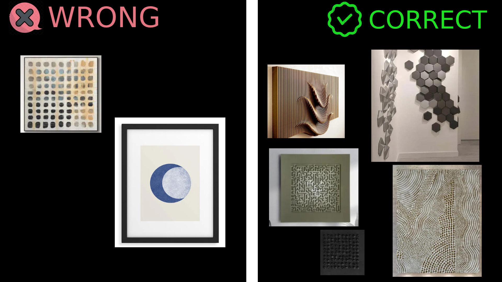

# 3d small dot UI

**3d small dot UI description:**

- serious gray UI that looks metallic
- looks like 2027 UI vibes - not just only rounded corners and 2d UI but a bit of shape

**3d small dot UI vibes:**

- it's kinda next.js SSG vibes
- feels like other side of website - like darknet - like something others shouldn't see
- feels very protected and secure
- feels like it will work and show always accurate data
- NASA vibe where everything is crystal crear and detailed e.g 0.40321 nano-seconds

**♫ Music that would help to understand vibe:**

public/UI/admin-dashboard
├── button10.wav
├── button11.wav
├── button1.wav
├── button2.wav
├── button3.wav
├── button4.wav
├── button5.wav
├── button6.wav
├── button7.wav
├── button8.wav
└── button9.wav

These sounds are similar to:

1. electrical gate cloing on button press
2. sound of old lighting in doctor room in hospital at quite night
3. soud of button press then sound of "pilim" (if accepted) or "pere pym pym" (if rejected)

**🖼️ Images that would help to understand vibe:**

## How this screen extends those patterns

### Color palette

Stricter dark palette than DNC — explicit hex values, not theme tokens:

- `bg-[#777777]` - dark-gray background

rounded

activeTab → IDK yet
inactiveTab → IDK yet

**Text:** font-mono uppercase tracking-wide text-[9px] tablet:text-[10px]

NEVER EMBED .jpg from references into actuall UI for this UI
